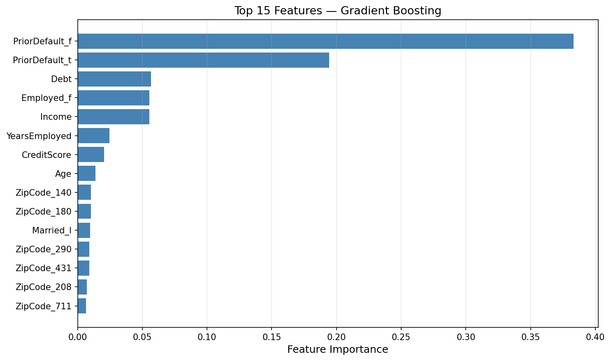
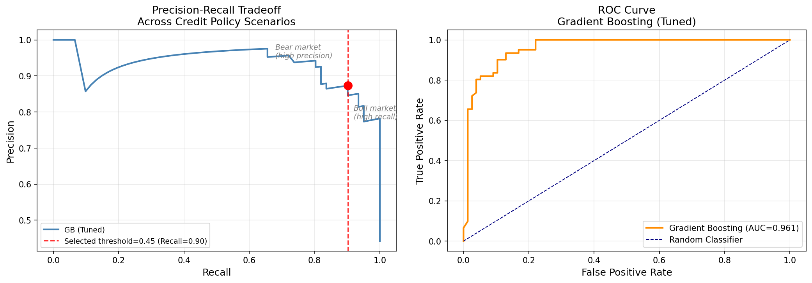

# Credit Card Approval Probability Prediction

A machine learning system that estimates the probability of credit card approval based on applicant financial and demographic attributes.  
The project simulates real-world underwriting logic and provides an interactive dashboard for evaluating approval likelihood before submitting a formal credit application.

---

## Problem Statement

Submitting a credit card application typically triggers a **hard credit inquiry**, which can temporarily lower an applicant's credit score.  

This project builds a predictive system that estimates the **probability of approval before applying**, helping applicants assess their chances without impacting their credit profile.

---

## System Architecture


---

## Dataset

Dataset: Credit Card Approval Prediction Dataset (Kaggle / UCI Repository)

The dataset contains anonymized applicant attributes, including:

- Age
- Debt level
- Employment history
- Income
- Credit score
- Prior default history
- Demographic features

These variables simulate features commonly used in **credit underwriting models**.

---

## Project Workflow

### 1. Exploratory Data Analysis
- Missing value analysis
- Outlier detection
- Distribution analysis
- Correlation heatmap
- Bivariate analysis
- Statistical hypothesis testing (t-test, chi-square)

Goal: Identify key financial risk drivers.

---

### 2. Data Preprocessing

- Missing value imputation
- One-hot encoding of categorical variables
- Feature scaling for numerical variables
- Train-test split with stratification

Implemented using a **Scikit-learn pipeline** to avoid data leakage.

---

### 3. Model Benchmarking

Three models were trained and evaluated:

- Support Vector Machine (SVM)
- Gradient Boosting
- AdaBoost

Evaluation metrics:

- Recall
- ROC-AUC
- Confusion Matrix

---

### 4. Model Selection & Threshold Tuning

The final model was selected based on **recall performance**.

In an expansionary credit environment, financial institutions prioritize capturing creditworthy applicants while tolerating moderate risk.

Final model:

**Gradient Boosting Classifier** (tuned with RandomizedSearchCV)

Performance:

| Metric | Score |
|------|------|
| Mean Recall | ~0.92 |
| Mean ROC-AUC | ~0.94 |
| Decision Threshold | 0.421 |

Measured using **5-fold stratified cross-validation**.

**Threshold Optimization:** The decision threshold was tuned separately to maximize recall, allowing the model to approve borrowers at a probability threshold of **0.421** instead of the default 0.5, making approval decisions more lenient under expansionary policy.

### Feature Importance



The graph above shows the top 15 most important features in the Gradient Boosting model. Key drivers of approval decisions include credit score, income, and employment history.

### Model Evaluation Curves



The evaluation curves demonstrate the model's performance across different metrics, including ROC curves, precision-recall curves, and confusion matrices from cross-validation.

---

## Model Output & Decision Logic

The dashboard now provides **binary approval decisions** alongside probability estimates:

- **Probability Estimate**: Floating-point value (0-1) representing approval likelihood
- **Decision**: Binary classification (✅ APPROVED / ❌ DENIED) based on optimal threshold
- **Threshold**: 0.421 (optimized during model tuning)

Applicants with a predicted probability ≥ 0.421 receive an approval recommendation, enabling the institution to capture more creditworthy applicants under expansionary lending conditions.

---

## Deployment

The project includes an interactive **Streamlit dashboard** that allows users to enter applicant information and receive an approval probability estimate with a binary decision.

Architecture:

User Input → Streamlit App → AWS S3 → Gradient Boosting Model + Threshold → Prediction Output

The trained model and optimal threshold are stored on **AWS S3** and loaded dynamically by the application.

---

## Tech Stack

Python  
Scikit-learn  
Pandas  
NumPy  
Streamlit  
Plotly  
AWS S3  

---

## Repository Structure
```
credit-card-approval-ml/
│
├── app.py
├── requirements.txt
├── README.md
│
├── assets/
│   ├── architecture.png
│   ├── feature_importance.png
│   └── model_evaluation_curves.png
│
├── data/
│   └── credit_approval.csv
│
├── models/
│   ├── gb_credit_model.pkl
│   └── optimal_threshold.pkl
│
└── notebooks/
    ├── eda.ipynb
    └── modeling.ipynb
```


---

## Running the Application

Install dependencies:


pip install -r requirements.txt


Run the Streamlit dashboard:


streamlit run app.py


---

## Demo

Run locally:

streamlit run app.py

The dashboard allows users to enter applicant information and receive an estimate of approval probability.

---

## Future Improvements

- Add additional financial features
- Implement model monitoring
- Deploy dashboard publicly
- Improve the explainability visualization

---

## Author

Disha Patel  
Computer Science Student  
Interested in Machine Learning and Financial Modeling
