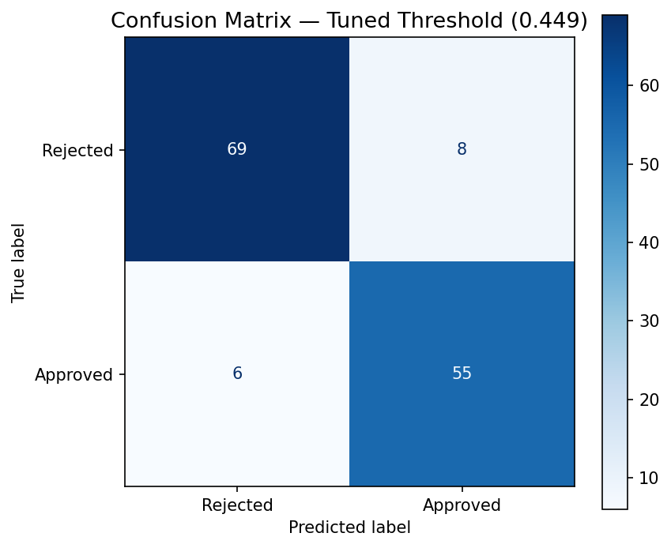

# Credit Card Approval Probability Prediction

A machine learning system that estimates the probability of credit card approval based on applicant financial and demographic attributes.  
The project simulates real-world underwriting logic and provides an interactive dashboard for evaluating approval likelihood before submitting a formal credit application.

---

## Problem Statement

Submitting a credit card application typically triggers a **hard credit inquiry**, which can temporarily lower an applicant's credit score.

This project builds a predictive system that estimates the **probability of approval before applying**, helping applicants assess their chances without impacting their credit profile.

---

## System Architecture
```
User Input → Streamlit App → AWS S3 (model + threshold) → Gradient Boosting Pipeline → Probability Output
```

---

## Dataset

**Source:** UCI Credit Approval Dataset (crx.csv)

The dataset contains anonymized applicant attributes including age, debt level, employment history, income, credit score, prior default history, and demographic features. These variables simulate features commonly used in credit underwriting models.

> **Note:** Column identities are anonymized in the original dataset. This project is a portfolio demonstration — a production system would use live bureau data (CIBIL, Experian, etc.).

**Target:** Binary approval label (+ → 1, - → 0)  
**Size:** 690 applicants, 15 features

---

## Project Workflow

### 1. Exploratory Data Analysis

- Missing value analysis (12 nulls in Gender/Age, handled via pipeline imputation)
- Outlier detection via boxplots
- Statistical hypothesis testing:
  - t-test: Approved applicants are significantly older (mean 33.7 vs 29.8, p < 0.00001)
  - t-test on log-income: Significant income difference between approved/rejected (p < 10⁻¹⁸)
  - Chi-square: PriorDefault is the strongest categorical predictor (χ² = 355, p < 10⁻⁷⁹)
- Correlation heatmap across numeric features
- Class balance: 55.5% rejected, 44.5% approved — minimal imbalance

---

### 2. Preprocessing Pipeline

Built using a Scikit-learn `ColumnTransformer` inside a `Pipeline` to prevent data leakage — all imputation and scaling is fit on training data only.

- **Numeric features:** Median imputation → Standard scaling
- **Categorical features:** Most-frequent imputation → One-hot encoding
- **Train/test split:** 80/20 with stratification on target label

---

### 3. Model Benchmarking (Default Threshold = 0.50)

Three models benchmarked on the held-out test set. Primary metric: **Recall** — minimizes false rejections of creditworthy applicants.

| Model | Recall | ROC-AUC | F1-Score | Precision |
| --- | --- | --- | --- | --- |
| SVM | 0.9180 | 0.9593 | 0.8889 | 0.8615 |
| AdaBoost | 0.9016 | 0.9606 | 0.8871 | 0.8730 |
| **Gradient Boosting** | **0.8852** | **0.9607** | **0.8780** | **0.8710** |

* Recall was prioritized because false rejections of creditworthy applicants are costly.
* Model selection was not based solely on Recall.
* Probability calibration and threshold optimization were also evaluated because the application outputs approval probabilities rather than only binary classifications.

---

### 4. Model Selection: Gradient Boosting

SVM achieved the highest recall at the default threshold, and AdaBoost matched Gradient Boosting's ROC-AUC almost exactly (0.9606 vs 0.9607). Because the application depends on approval probabilities and threshold-based decisioning, probability calibration was treated as a key model-selection criterion.

#### SVM
- Highest Recall among benchmarked models: 0.9180.
- Strong ROC-AUC performance: 0.9593.
- Competitive probability calibration with a Brier Score of 0.0766.
- Limitations:
  - Lower interpretability.
  - RBF kernel behaves as a black-box model.
  - Less suitable for explainable credit decisioning.
  - Feature-level explanations are less straightforward.

SVM was not selected because the application requires calibrated probability outputs and better explainability rather than recall alone.

#### AdaBoost
- Strong Recall: 0.9016.
- Very strong ROC-AUC: 0.9606.
- Strong threshold-optimized precision: 0.8871 at Recall ≥ 90%.
- Competitive overall classification performance.
- Limitations:
  - Probability calibration was significantly weaker than Gradient Boosting.
  - Higher Brier Score: 0.1678.
  - Slightly lower and less stable cross-validation ROC-AUC: 0.9326 ± 0.0173.
  - Less suitable for probability-based decision support.

AdaBoost was not selected because its calibration was weaker for probability decisioning, even though its classification metrics were strong.

#### Gradient Boosting
- Comparable ROC-AUC to AdaBoost: 0.9607.
- Strong threshold optimization performance.
- Best probability calibration among benchmarked models: Brier Score 0.0764.
- Lowest Brier Score.
- Slightly stronger and more stable cross-validation ROC-AUC: 0.9363 ± 0.0117.
- Native feature importance support.
- Well suited for probability-based credit decisioning.

Gradient Boosting was selected because the application depends on calibrated probabilities, threshold optimization, stability, and explainability rather than recall alone.

### Probability Calibration Analysis

The model comparison included a dedicated calibration evaluation using Brier Score. Calibration is important because this application reports approval probabilities, and well-calibrated outputs make threshold-based decisions more reliable.

| Model | Brier Score |
| --- | --- |
| Gradient Boosting | 0.0764 |
| SVM | 0.0766 |
| AdaBoost | 0.1678 |

Gradient Boosting achieved the best calibration score. Lower Brier Score indicates better probability calibration. The calibration curve visualization is available in `assets/calibration_reliability_curves.png`.

---

### 5. Hyperparameter Tuning

`RandomizedSearchCV` with `scoring='recall'` over 5-fold stratified cross-validation.

**Best parameters:**
- n_estimators: 100
- max_depth: 3
- learning_rate: 0.1
- subsample: 1.0
- min_samples_split: 2

---

### 6. Threshold Optimization (Credit Policy Alignment)

The default 0.50 threshold assumes symmetric misclassification costs. In credit lending, costs are asymmetric and cycle-dependent.

**Expansionary policy:** Find the highest-precision threshold that still achieves ≥ 90% recall — capturing creditworthy applicants at a controlled false positive rate.

**Selected threshold: 0.449**

Both Gradient Boosting and AdaBoost were evaluated under the same Recall ≥ 90% constraint.
- Gradient Boosting selected threshold: 0.449, with tuned precision 0.8730 at Recall 0.9016.
- AdaBoost selected threshold: 0.502, with tuned precision 0.8871 at Recall 0.9016.

This confirms both models were assessed using the same policy-aligned recall target.

---

### 7. Final Model Performance (Tuned Threshold = 0.449)



| Metric | Score |
| --- | --- |
| Recall | 0.9016 |
| ROC-AUC | 0.9607 |
| F1-Score | 0.8871 |
| Precision | 0.8730 |

Validated via **5-fold stratified cross-validation:**
- Mean Recall: 0.8534 ± 0.0459
- Mean ROC-AUC: 0.9363 ± 0.0117

This performance was validated using threshold optimization, probability calibration, and 5-fold cross-validation.

---

### 8. Feature Importance (Top 5)

| Feature | Importance |
| --- | --- |
| PriorDefault (No History) | 0.383 |
| PriorDefault (Has History) | 0.194 |
| Debt | 0.057 |
| Employment Status | 0.055 |
| Income | 0.055 |

This feature importance summary is presented as a post-selection interpretability analysis rather than a model-selection justification. Prior default history is overwhelmingly the strongest predictor, which is consistent with real-world credit underwriting.

---

## Model Interpretability

The model is SHAP-compatible, and SHAP-based explanation support is a planned extension for the dashboard. The current application does not yet expose dashboard-integrated SHAP explanations.

---

## Deployment

Trained model and optimal threshold stored on **AWS S3**, loaded dynamically by the Streamlit application.
```
User Input → Streamlit App → AWS S3 → Gradient Boosting Pipeline → Probability + Gauge Chart
```

---

## Tech Stack

Python · Scikit-learn · Pandas · NumPy · Streamlit · Plotly · SHAP · AWS S3

---

## Repository Structure
```
credit-card-approval-ml/
│
├── app.py
├── requirements.txt
├── README.md
│
├── data/
│   └── raw/
│       └── crx.csv
│
├── models/
│   ├── gb_credit_model.pkl
│   └── optimal_threshold.pkl
│
├── assets/
│   ├── architecture.png
│   ├── calibration_reliability_curves.png
│   ├── class_separation.png
│   ├── evidence_table.csv
│   ├── feature_importance.png
│   ├── model_evaluation_curves.png
│   └── probability_distribution_models.png
│
└── notebooks/
    ├── eda.ipynb
    └── modeling.ipynb
```

---

## Running the Application
```bash
pip install -r requirements.txt
streamlit run app.py
```

---

## Future Improvements

- Add Expected Loss framework (PD × LGD × EAD)
- Deploy dashboard publicly via Streamlit Community Cloud
- Add model monitoring for distribution drift
- Add probability calibration monitoring
- Add portfolio-level credit risk analytics
- Expand SHAP visualizations within the dashboard
- Incorporate additional financial features (debt-to-income ratio, transaction velocity)

---

## Author

Disha Patel — Computer Science Student  
Interests: Machine Learning · Financial Modeling · Credit Risk